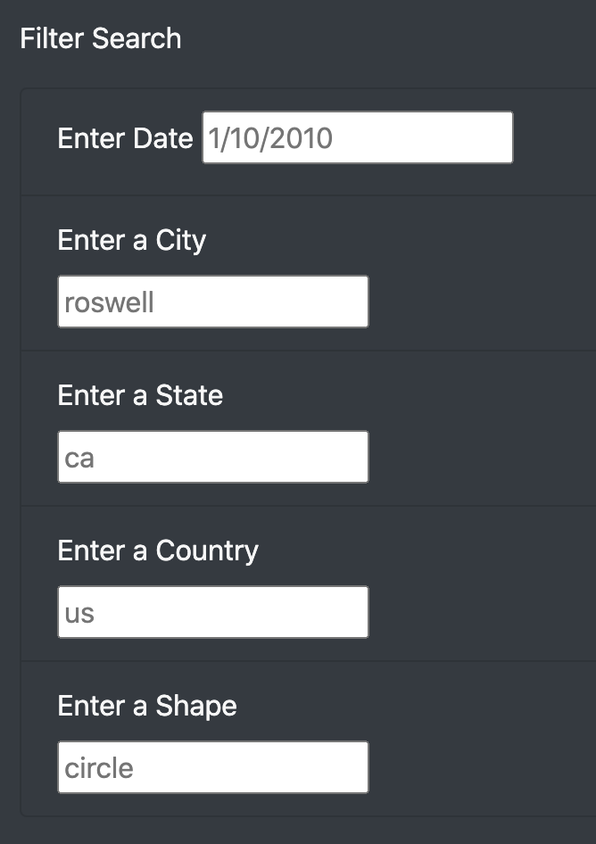

# An interactive webpage on the UFO sighting data

## Overview of the Analysis

The purpose of this analysis is to create a dynamic table using JavaScript and make the table interactive using Bootstrap, so that people can filter the UFO sighting data by state, city, date, shape or country according to their own interests.

## Results

The webpage display the entire list of data by default. To filter the data, we can use the text boxes in the "Filter Search" region shown below. 

We can filter the data by any criteria listed below. For example, if we want to look at the sighting record on 1/1/2010, we can type "1/1/2010" in the "Enter Data" box. And all the sighting record for 1/1/2010 will be displayed.

We can also filter the data further by adding more criteria. For example, if we only want to look at the sighting event in city "la mesa" on 1/1/2010, we can add one more condition for city as shown below.

## Summary

The major drawback of this webpage is that the data cannot be sorted. Therefore, the first recommendation for the webpage is to develop the sorting feature for data. Another recommendation is that the filter tool can only accept a single element for each property, it's better to develop multiple options for the filter tools.